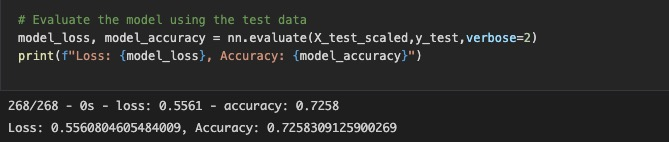

# Neural_Network_Charity_Analysis

## Overview of the loan prediction risk analysis:

- The project aims to analyze and classify the success of charitable donation and examine potential recipients by predicting which organizations are worth donating and which organizations are too risky.

## Results:

- Data Preprocessing

    - 
    - What variable(s) are considered the target(s) for your model?
        - The target was considered to be the "IS_SUCCESSFUL" column, since it is a result for the donation whether it is success or not.

    - What variable(s) are considered to be the features for your model?
        - APPLICATION_TYPE', 'AFFILIATION', 'CLASSIFICATION', 'USE_CASE', 'ORGANIZATION', 'INCOME_AMT','SPECIAL_CONSIDERATIONS' are considered to be the features for my model.
    
    - What variable(s) are neither targets nor features, and should be removed from the input data?
        - 'EIN', 'Name' are not useful for my model, therefore, I removed them.

- Compiling, Training, and Evaluating the Model

    - How many neurons, layers, and activation functions did you select for your neural network model, and why?
        - Attempt 1
        - 
        - 

        - Attempt 2
        - 
        - 

        - Attempt 3
        - 
        - 

        - Attempt 4
        - 
        - 

        - Attempt 5
        - 
        - 

        - Attempt 6
        - 
        -        

        - Actually, I tried more than 20 times in different ways to try to get 75% accuracy, but never did. 

    - Were you able to achieve the target model performance?
        - No, the target model performance is 75%, I tried a lot of ways, but never achieved target as 75%. The highest accuracy I could achieve 72.64%

    - What steps did you take to try and increase model performance?
        - I removed noisy variable, added additional neurons, added hidden layers, change activation function to try to increasse performance, but did not achieve the target.

## Summary:
- There is a summary of the results.
    - The deep learning neural network model does not meet requirment, which target is 75% accuracy.

- There is a recommendation on using a different model to solve the classification problem, and justification.
    - I would make recommendation on using Random Forest Classifiers, since it is combines multiple smaller models into a more robust and accurate model. Moreover, the random forest model is able to achieve comparable predictive accuracy on large tabular data with less code and faster performance.